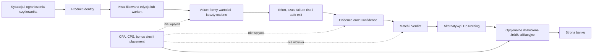
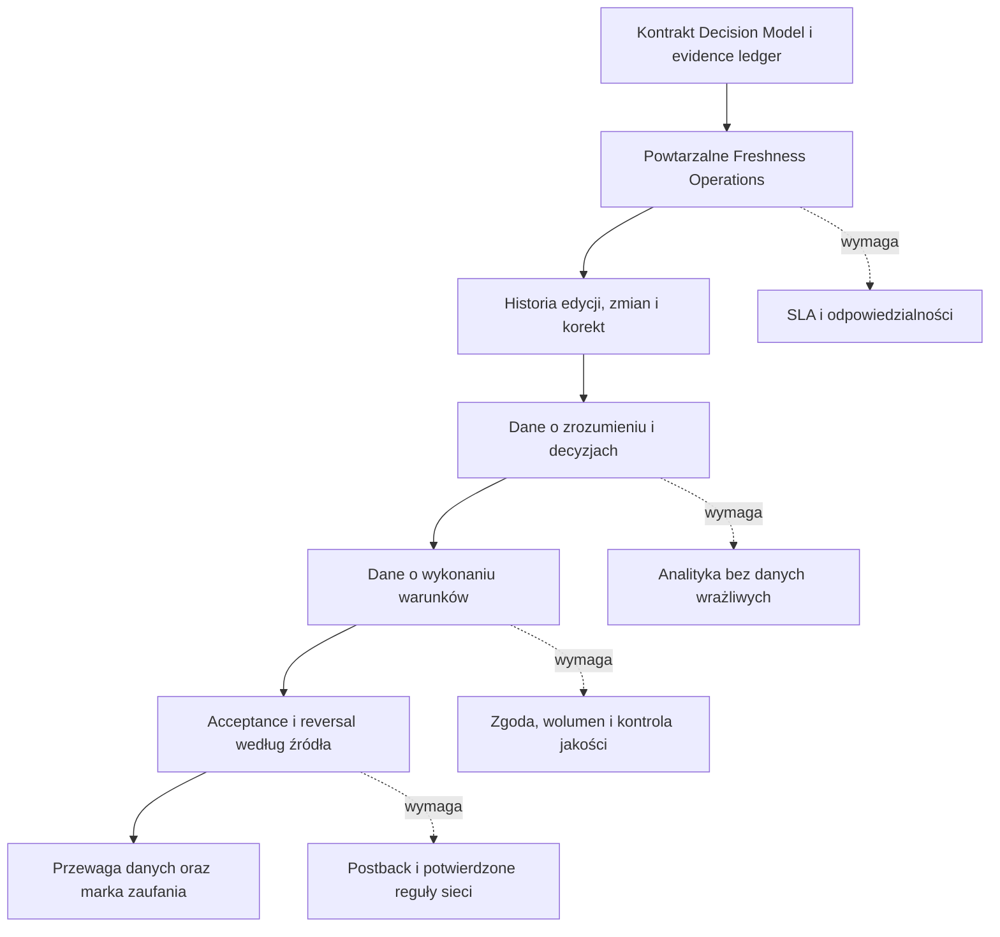

# ProjectNorth — strategiczny przegląd analizy Gemini

> Data: 2026-08-24
> Status: materiał researchowy i decyzyjny, nie ADR, nie zatwierdzona zmiana roadmapy i nie upoważnienie do implementacji
> Zakres: ocena tez Gemini o produkcie, rynku, monetyzacji, przewagach i kolejnych ruchach

## Executive summary

Analiza Gemini jest użyteczna jako lista hipotez, ale nie jako analiza inwestycyjna ani prognoza finansowa. Trafnie identyfikuje problem użytkownika, koszt utrzymywania aktualnego evidence, ryzyko niskiej retencji, konflikt krótkoterminowej afiliacji z zaufaniem oraz możliwą przyszłą wartość danych o wykonaniu promocji.

Jednocześnie Gemini:

- błędnie redefiniuje North jako automatyczny kalkulator EV i audytora regulaminów;
- opisuje przyszłą automatyzację i potencjalny moat jak istniejące aktywa;
- przedstawia niezweryfikowane CPA, reversale, MAU, terminy i prawdopodobieństwa z fałszywą precyzją;
- upraszcza konkurencję do modelu „najwyższa prowizja wygrywa”, bez wystarczających dowodów;
- proponuje skalowanie katalogu, tracker, e-mail i ekspansję zagraniczną przed walidacją obecnego rdzenia;
- pomija faktyczny stan projektu: katalog 12 ofert jest już publiczny, a aktywnym etapem jest v0.8.0 Alternative Comparison & Product Identity Mapping.

Najlepsza część odpowiedzi Gemini to diagnoza problemu. Najsłabsza to model finansowy i harmonogram przychodów.

## 1. Faktyczny punkt wyjścia

Stan zweryfikowany w repo i produkcji 2026-08-24:

- publiczny katalog zawiera 12 ofert;
- aktywnym etapem jest v0.8.0 Alternative Comparison & Product Identity Mapping na poziomie researchu, mapowania, official evidence i prototypu;
- prywatna beta została przesunięta do kamienia 1.0 po wdrożeniu i jakościowej walidacji Alternative Comparison;
- analytics, backend, persistence i profile użytkowników nie są wdrożone;
- projekt ma ręczny evidence ledger oraz techniczny Data Integrity & Freshness Guard, ale nie ma automatycznego audytora regulaminów;
- odpowiedzi supportów sieci afiliacyjnych dotyczące trackingu, acceptance, reversal, cross-device, postbacków i zasad źródeł nadal są oczekiwane;
- realized affiliate economics nie zostały jeszcze udowodnione własnymi danymi.

Odpowiedź na pytanie Gemini o stan analityki:

> Integracja analityki lejkowej jest obecnie na etapie 0. Istnieje plan małego pilota trackingowego, ale nie ma jeszcze produkcyjnego kontraktu zdarzeń ani wdrożonego narzędzia. Publiczna strona działa, lecz North nie jest gotowy na ruch traktowany jako wiarygodny eksperyment ilościowy przed zdefiniowaniem analityki i ukończeniem bram v0.8.0.

## 2. Co Gemini oceniło dobrze

| Teza | Ocena | Uzasadnienie |
| --- | --- | --- |
| North zmniejsza asymetrię informacyjną i przeciążenie warunkami | Trafna | To podstawowy problem rozwiązywany przez Value, Match, Verdict i Evidence. |
| Marketingowe maksimum nie jest wartością użytkownika | Trafna | Jedna z nienaruszalnych zasad produktu. |
| Trzeba rozdzielać gotówkę, voucher, nagrodę rzeczową, odsetki i opłaty | Trafna | Zgodne z obecnym kontraktem danych i guardami semantycznymi. |
| `SKIP` i `Do Nothing` mogą budować wiarygodność | Trafna | O ile nie staną się teatralnym antymarketingiem. |
| Aktualizacja regulaminów będzie kosztowna | Trafna i krytyczna | Freshness Operations mogą być trudniejsze niż samo tworzenie UI. |
| Dane o rzeczywistym wykonaniu warunków mogą być przewagą | Trafna jako kierunek | To potencjalny moat, ale jeszcze nie istnieje. |
| Retencja może być niska | Trafna hipoteza | Sam wybór rachunku jest zadaniem rzadszym niż codzienne zarządzanie finansami. |
| Długi Match może powodować porzucenia | Trafna | Pytania muszą być materialne i progresywne. |
| Nie budować teraz aplikacji mobilnej | Trafna | Responsive web jest wystarczający. |
| Nie budować open bankingu ani pełnego profilu | Trafna | Byłoby to przedwczesne, kosztowne i prawnie cięższe. |
| Nie skalować od razu do setek ofert | Trafna | Kontrolowany katalog jest właściwszy od hurtowego importu. |
| Dekonstrukcje promocji mogą wspierać dystrybucję | Trafna warunkowo | Muszą opierać się na evidence, nie na sensacyjnych procentach bez danych. |

## 3. Co jest błędne albo nieudowodnione

### 3.1. North nie jest automatycznym audytorem regulaminów

Dzisiaj evidence jest zbierane i weryfikowane ręcznie. Data Guard sprawdza strukturę, referencje, kontrakty i freshness, lecz nie dowodzi prawdziwości regulaminu ani nie rozstrzyga konfliktów źródeł.

Poprawne określenie:

> North jest wyjaśnialnym systemem decyzji z ręcznie audytowanym evidence i technicznymi guardami integralności.

Przyszły monitoring zmian może tworzyć alert do ręcznego review. Nie powinien samodzielnie aktualizować faktu finansowego, Confidence ani Verdict.

### 3.2. Arbitralny EV byłby krokiem wstecz

Gemini centralizuje produkt wokół wartości oczekiwanej skorygowanej o wysiłek, płynność i ryzyko. Taki wynik wygląda naukowo, ale wymaga arbitralnych wag:

- wyceny czasu użytkownika;
- prawdopodobieństwa zapomnienia warunku;
- wymienności vouchera i gotówki;
- wyceny stresu, elastyczności i zamrożenia kapitału;
- założeń o zachowaniu bez danych wykonania.

North powinien nadal jawnie rozdzielać:

- wartość użyteczną;
- koszt bezpośredni;
- opportunity cost;
- effort;
- czas;
- failure risk;
- elastyczność;
- Confidence.

EV może kiedyś wystąpić wyłącznie jako jawny scenariusz z widocznymi założeniami, nie jako ukryty wynik centralny.

### 3.3. Obraz konkurencji jest zbyt wygodny

Nie ma podstaw, by twierdzić, że wszystkie porównywarki kierują użytkownika wyłącznie do najwyżej płacącego banku. Niektóre publikują metodologię, profile modelowe, opłaty i warunki. Serwisy promocji utrzymują również archiwa regulaminów i materiały wykonawcze.

North nie powinien budować marki na twierdzeniu, że inni są nieuczciwi. Przewaga powinna być obserwowalna w produkcie:

> North wyjaśnia, dlaczego decyzja zmienia się dla konkretnego scenariusza, które dane ją podpierają oraz kiedy uczciwą alternatywą jest brak działania.

### 3.4. Moat nie istnieje jeszcze

North nie ma jeszcze:

- istotnej liczby wykonanych decyzji;
- danych o realizacji warunków;
- wiarygodnej bazy acceptance i reversal;
- potwierdzonego postbacku afiliacyjnego;
- długiej historii porównywalnych edycji;
- wystarczającego ruchu, aby brand trust był fosą konkurencyjną.

Execution Data, historia zmian i marka zaufania są mapą możliwego moatu, nie aktualnymi aktywami.

### 3.5. Persony są hipotezami

Ocena robocza:

- **Optymalizator Czasu** — najlepszy kandydat na pierwszego odbiorcę. Ma realny ból, ale nie chce sam analizować PDF-ów.
- **Promo Hunter** — dobry ekspert testowy i źródło problemów execution, ale słabszy główny segment. Często ma własny workflow i wiedzę.
- **Student** — realny segment produktowy, lecz ważniejsze są faktyczne ograniczenia: wiek, wpływy, tolerancja opłat i potrzeba funkcjonalna.

Lepsze od person demograficznych będą zadania użytkownika:

1. Chcę uniknąć nieoczekiwanej opłaty.
2. Chcę premię bez zmiany codziennych nawyków.
3. Potrzebuję konkretnej funkcji produktu, nie tylko premii.
4. Chcę wiedzieć, czy kwalifikuję się do aktualnej edycji.
5. Chcę bezpiecznie dowieźć warunki po otwarciu konta — potencjalny późniejszy Offer Execution.

### 3.6. Wielkość rynku nie dowodzi popytu na North

Duża liczba istniejących rachunków i wysoka dostępność internetu pokazują szeroką bazę produktów oraz cyfrową dostępność. Nie mówią jednak:

- ilu użytkowników rocznie aktywnie szuka nowego rachunku;
- ilu szuka promocji, a ilu funkcji produktu;
- ilu użyje narzędzia decyzyjnego;
- jaki udział ruchu będzie kwalifikował się do oferty;
- jaki jest serviceable obtainable market North.

Nie ma wystarczającej podstawy dla prognoz Gemini dotyczących:

- MAU w horyzoncie 12–36 miesięcy;
- sufitu 300–500 tys. UU miesięcznie w Polsce;
- 75% szansy na 10 tys. MAU;
- 30% szansy na 100 tys. MAU;
- 8% szansy na 100 tys. EUR miesięcznie.

Są to liczby narracyjne, nie prognozy oparte na base rates lub danych North.

## 4. Audyt modelu finansowego

Gemini przyjęło:

```text
50% uruchamia analizę
× 18% przechodzi do afiliacji
× 15% składa wniosek
× 70% zostaje zaakceptowanych
= 0,945% paid conversion z całego ruchu
```

Arytmetyka jest poprawna:

```text
0,50 × 0,18 × 0,15 × 0,70 = 0,00945
```

Nieudowodnione są wartości wejściowe.

Jeżeli mimo to zachowamy założenia Gemini oraz payout `130–200 PLN`, otrzymamy:

| Ruch miesięczny | Zaakceptowane konta przy 0,945% | Przychód przy 130 PLN | Przychód przy 200 PLN | Zakres Gemini |
| ---: | ---: | ---: | ---: | ---: |
| 1 000 | 9,45 | 1 229 PLN | 1 890 PLN | 1 400–1 800 PLN |
| 10 000 | 94,5 | 12 285 PLN | 18 900 PLN | 14 500–19 000 PLN |
| 50 000 | 472,5 | 61 425 PLN | 94 500 PLN | 75 000–102 000 PLN |
| 100 000 | 945 | 122 850 PLN | 189 000 PLN | 155 000–215 000 PLN |
| 1 000 000 | 9 450 | 1 228 500 PLN | 1 890 000 PLN | 1 700 000–2 400 000 PLN |

Gemini podnosi Revenue per Visit wraz ze skalą bez pokazania mechanizmu tej poprawy. Lepsze umowy przy dużym wolumenie są możliwe, ale nie powinny być wbudowane w prognozę przed ich potwierdzeniem.

Nie ma również wystarczającej podstawy dla ogólnego reversal rate `20–40%`. Różne kampanie rozliczają inne zdarzenia, mają inne warunki aktywności, segmenty, okresy i zasady odrzucenia.

Poprawny model powinien być sterowany obserwacjami:

```text
Realized RPV
= udział kwalifikowanych sesji
× outbound rate
× application rate
× acceptance rate
× payout po korektach
```

Każdy parametr wymaga:

- wartości obserwowanej;
- liczebności próby;
- przedziału niepewności;
- źródła i okresu;
- produktu i wariantu;
- sieci oraz definicji konwersji.

Do tego czasu model służy do analizy wrażliwości, nie do obiecywania terminu przychodu.

## 5. Lepsza definicja North

> ProjectNorth jest wyjaśnialnym systemem wyboru i bezpiecznego wykonania decyzji dotyczących okazji finansowych. Zaczyna od sytuacji użytkownika, rozdziela produkt od promocji i źródła afiliacyjnego, pokazuje wartość, warunki, ryzyko, evidence, alternatywy oraz `Do Nothing`.



## 6. Jak North może być lepszy

### 6.1. Pokazywać zmianę decyzji

Najsilniejszy mechanizm:

> Gdy zmienisz tę odpowiedź, wynik zmieni się z `TAKE IF` na `SKIP`, ponieważ pojawia się opłata albo tracisz użyteczność części nagrody.

To jest trudniejsze do zastąpienia prostym podsumowaniem LLM niż sam opis promocji.

### 6.2. Rozdzielić produkt od promocji

Najpierw użytkownik powinien otrzymać odpowiedź:

- jaki Product Identity pasuje do jego sytuacji;
- jaka jest funkcjonalna przewaga;
- jaki jest koszt niedopasowania;
- jakie są uczciwe alternatywy.

Dopiero potem:

- która edycja go obejmuje;
- który wariant jest dostępny;
- jakie źródło afiliacyjne jest dozwolone.

### 6.3. Zbudować mierzalną przewagę operacyjną

Wskaźniki jakości evidence mogą obejmować:

- udział krytycznych pól z oficjalnym źródłem;
- udział aktywnych ofert bez zaległego rechecku;
- liczbę nierozwiązanych konfliktów;
- medianę wieku weryfikacji;
- czas od wykrycia zmiany do ponownego review;
- liczbę korekt i ich jawne przyczyny;
- liczbę ofert zakończonych `NOT ENOUGH DATA`.

### 6.4. Budować moat etapami



North znajduje się obecnie przy pierwszym etapie, nie przy ostatnim.

### 6.5. Prowadzić widoczny proces korekt

Wiarygodność wymaga:

- daty korekty;
- wskazania zmienionego pola;
- informacji, czy wcześniejszy Verdict mógł być inny;
- opisu zmiany procesu;
- zachowania audytowalnej historii.

Zaufanie nie oznacza nieomylności. Oznacza szybkie, widoczne i sprawdzalne naprawianie błędów.

## 7. Kontrakt analityki przed prywatną betą

### Minimalne zdarzenia

| Zdarzenie | Cel | Bezpieczne właściwości |
| --- | --- | --- |
| `catalog_viewed` | Początek ścieżki | route, referrer category |
| `comparison_started` | Intencja rozpoczęcia decyzji | entry point, comparison version |
| `question_viewed` | Miejsce potencjalnego porzucenia | question ID, step number |
| `question_answered` | Przejście dalej | question ID, bez swobodnego tekstu |
| `comparison_completed` | Ukończenie flow | product family, Match band, Confidence band |
| `verdict_viewed` | Dotarcie do wyniku | Verdict, scenario version |
| `reason_opened` | Użycie wyjaśnienia | reason category |
| `evidence_opened` | Użycie evidence | source type, field ID |
| `alternative_opened` | Rozważenie alternatywy | alternative type |
| `do_nothing_selected` | Pełnoprawna decyzja | reason category |
| `outbound_clicked` | Wyjście do banku | offer ID, source ID, placement ID |
| `correction_reported` | Potencjalny błąd | offer ID i field ID; opis poza analytics |

Do analytics nie powinny trafiać:

- imię, e-mail, telefon ani PESEL;
- dokładny dochód;
- numery rachunków;
- swobodne odpowiedzi;
- pełna kombinacja danych umożliwiająca łatwe odtworzenie sytuacji finansowej;
- identyfikator śledzący osobę między urządzeniami.

### Dwa osobne lejki

Lejek produktu:

```text
katalog
→ rozpoczęcie porównania
→ ukończenie
→ zrozumienie wyniku
→ evidence / alternatywa / Do Nothing
→ opcjonalne wyjście
```

Lejek afiliacyjny:

```text
outbound click
→ wniosek
→ pending
→ accepted/rejected
→ wypłacona konwersja
```

Client-side analytics nie dowodzi akceptacji konta. Potrzebny jest potwierdzony `subID/EPI`, postback albo raport sieci.

## 8. Co mierzyć zamiast samego „2× CR”

### Metryki podstawowe — jakość decyzji

- Czy użytkownik rozumie powód Verdict?
- Czy potrafi wskazać główny warunek i bloker?
- Czy odróżnia gotówkę od vouchera, nagrody rzeczowej i odsetek?
- Czy rozumie, co zmieniłoby decyzję?
- Czy widzi `Do Nothing` jako prawidłową alternatywę?
- Czy wybiera właściwy Product Identity?
- Czy rozpoznaje `NOT ENOUGH DATA` jako uczciwy wynik, nie awarię?

### Metryki wtórne — biznes

- outbound rate wśród scenariuszy dopuszczających działanie;
- application rate z raportu sieci;
- acceptance rate według produktu i źródła;
- realized payout;
- liczba korekt i reklamacji;
- koszt utrzymania jednej aktywnej analizy;
- przychód po koszcie evidence operations.

### Guardrails

- afiliacja nie zmienia Value, Match, Confidence ani Verdict;
- udział `SKIP` nie jest porażką;
- brak aktywnego CTA nie obniża oceny produktu;
- krytyczny konflikt evidence blokuje pozytywny Verdict;
- nie usuwa się materialnych pytań Match tylko po to, aby zwiększyć completion lub conversion.

### Skala przykładowego eksperymentu

Jeżeli outbound-to-application CR wynosiłby 15%, a celem byłoby wykrycie wzrostu do 30%, potrzeba orientacyjnie około 121 outboundów na wariant, czyli około 242 łącznie, przy typowych założeniach 95% confidence i 80% power.

Przy założeniu Gemini, że outbound stanowi 9% ruchu, oznaczałoby to około 2,7 tys. użytkowników przed uwzględnieniem odrzuceń, problemów atrybucji, różnic produktów i zmian kampanii. Dlatego „udowodnić 2× w 90 dni” nie jest sensownym zobowiązaniem bez planu próby.

## 9. Rekomendowana kolejność ruchów

### Teraz — research i v0.8.0

1. Dokończyć Alternative Comparison na kontrolowanym przypadku mBank.
2. Zweryfikować official evidence dla Product Identities i promocji używanych w prototypie.
3. Przygotować kontrakt analityczny: zdarzenia, dozwolone właściwości, zakazane dane, retencję i QA.
4. Potwierdzić z sieciami: źródła ruchu, social/community, cookie window, cross-device, acceptance, reversal, validation time, caps, EPI/subID, postback i zasady własnego copy.
5. Wykonać ograniczony przegląd prawny przed aktywacją afiliacji, szczególnie dla oznaczeń reklamowych, zasad porównywania rachunków i prywatności analityki.

### Osobny zatwierdzony task implementacyjny

6. Zaimplementować zatwierdzony kontrakt Alternative Comparison.
7. Dodać minimalną analitykę do nowego flow.
8. Zweryfikować desktop/mobile, klawiaturę, niepełne odpowiedzi, event duplication, back/reload, wyłączenie ruchu wewnętrznego i brak danych wrażliwych w payloadach.

### Prywatna beta 1.0

9. Rozpocząć od 8–12 testów jakościowych z zadaniami scenariuszowymi.
10. Naprawić krytyczne niezrozumienia dotyczące produktu, promocji, formy nagrody, kwalifikacji, Match, Verdict i `Do Nothing`.
11. Następnie uruchomić kontrolowany ruch i zbudować rzeczywisty baseline lejka.

### Dopiero po danych z bety

12. Rozważyć lekki Offer Execution Checklist, jeżeli użytkownicy rzeczywiście potrzebują pomocy po otwarciu konta.
13. Rozważyć wewnętrzne alerty zmian źródeł tworzące zadania do review.
14. Rozszerzać katalog tylko po ustabilizowaniu freshness operations dla obecnych ofert.
15. Budować historię edycji i dane wykonania dopiero przy odpowiednim wolumenie, zgodzie i procedurze korekt.

## 10. Czego nie robić teraz

- Nie zwiększać katalogu do 40 lub 200 ofert.
- Nie budować trackera przed walidacją potrzeby Offer Execution.
- Nie budować konta użytkownika ani pełnego profilu finansowego.
- Nie uruchamiać e-maili o końcu karencji bez dowodu potrzeby i modelu danych.
- Nie integrować open bankingu.
- Nie budować aplikacji mobilnej.
- Nie otwierać rynków zagranicznych.
- Nie przedstawiać bezpośrednich integracji z bankami jako celu przed udowodnieniem ruchu i neutralności.
- Nie publikować tez typu „40% osób nie dostanie premii” bez własnych danych.
- Nie przedstawiać nominalnego CPA jako przychodu.
- Nie traktować `SKIP` jako utraconej konwersji do naprawienia.
- Nie przestawiać v0.8.0 na growth sprint z powodu atrakcyjnych prognoz Gemini.

## 11. Wniosek końcowy

North ma realną i czytelną różnicę produktową, lecz nie ma jeszcze dowodu rynku ani sprawdzonej ekonomii. Najważniejsze pytanie nie brzmi obecnie „czy North może dojść do 100 tys. EUR miesięcznie?”, tylko:

> Czy użytkownik potrafi na podstawie North wybrać właściwy produkt, rozumie powód decyzji i unika błędu, którego nie uniknąłby na tradycyjnej liście ofert?

Jeżeli odpowiedź będzie pozytywna, można budować dystrybucję i realized economics. Jeżeli nie, większy katalog, tracker, SEO i afiliacja zwiększą jedynie skalę niezweryfikowanego produktu.

## Źródła użyte w przeglądzie

### Kanoniczne źródła ProjectNorth

- `README.md`;
- `docs/NORTH_STATE.md`;
- `docs/CONTEXT_MAP.md`;
- `docs/HANDBOOK.md`;
- `docs/DECISIONS.md`;
- `docs/ROADMAP.md`;
- `docs/AI_WORKFLOW.md`;
- `docs/SYNC_PROTOCOL.md`;
- `frontend/data/decision-offers.json` i kod odpowiedzialny za Match oraz afiliacyjne CTA.

### Zewnętrzne źródła referencyjne

- [Narodowy Bank Polski, *Ocena funkcjonowania polskiego systemu płatniczego w I półroczu 2024 r.*](https://nbp.pl/wp-content/uploads/2024/11/Ocena-I-polrocze-2024.pdf) — liczba rachunków osób fizycznych;
- [Główny Urząd Statystyczny, *Społeczeństwo informacyjne w Polsce w 2024 roku*](https://stat.gov.pl/obszary-tematyczne/nauka-i-technika-spoleczenstwo-informacyjne/spoleczenstwo-informacyjne/spoleczenstwo-informacyjne-w-polsce-w-2024-roku%2C2%2C14.html) — cyfrowa dostępność;
- [UOKiK, Influencer marketing](https://www.uokik.gov.pl/public/influencer-marketing) — rekomendacje dotyczące oznaczania treści reklamowych i linków afiliacyjnych;
- [ustawa o usługach płatniczych — tekst jednolity](https://eli.gov.pl/api/acts/DU/2024/30/text.html), w szczególności reguły dotyczące określonych stron porównujących opłaty związane z rachunkami;
- [Totalmoney — ranking kont osobistych](https://www.totalmoney.pl/konta_bankowe) i [Bankobranie — repozytorium regulaminów](https://www.bankobranie.pl/p/repozytorium.html) — przykłady realnych funkcji konkurencyjnych wykraczających poza samą ekspozycję CTA;
- [System Partnerski — tabela wynagrodzeń](https://www.systempartnerski.pl/static/pdf/tabela_wynagrodzenia.pdf), [SuperPartners](https://superpartners.pl/) i [ComperiaLead — przykład kampanii](https://www.comperialead.pl/wyzsza-stawka-cps-240-zl-konkurs-santander-bank-polska-konto-santander-20250902125053.html) — przykłady zróżnicowanych stawek i definicji rozliczenia, niewystarczające do wyznaczenia uniwersalnej średniej;
- [Plausible Analytics — dokumentacja](https://plausible.io/docs) i [data policy](https://plausible.io/data-policy) — deklaracje dostawcy dotyczące zakresu danych, cookies i prywatności, wymagające oceny własnej konfiguracji.

## Status publikacji tego dokumentu

Dokument zapisuje wynik researchu. Sam w sobie:

- nie zmienia Decision Model;
- nie zmienia aktywnej roadmapy;
- nie zatwierdza narzędzia analitycznego;
- nie zatwierdza implementacji;
- nie aktywuje afiliacji;
- nie zmienia danych ofertowych;
- nie upoważnia do commit, push ani deploy.
